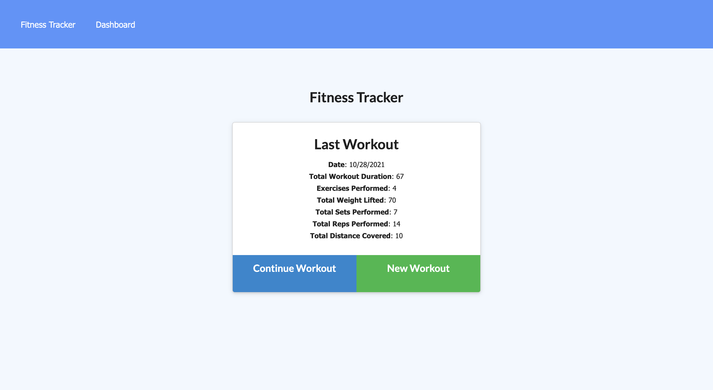
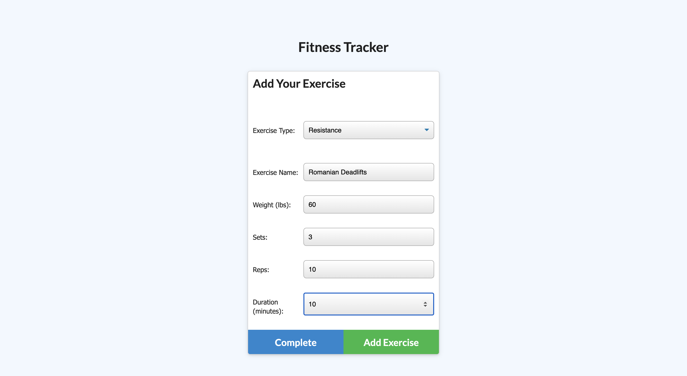
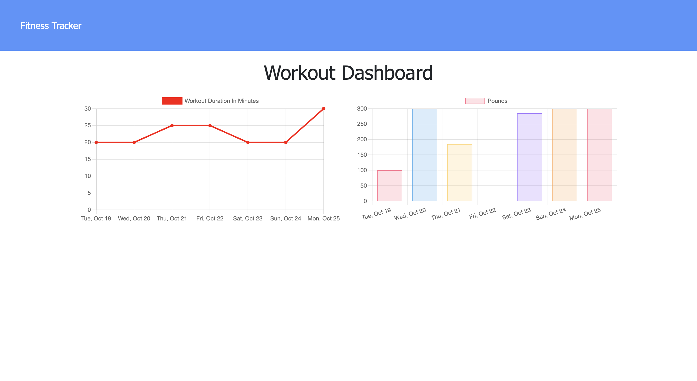

# Stay-Fit

https://stay-fit-fitness-tracker.herokuapp.com/

## Description 

This is a simple workout tracker that allows user to view, create, and track daily **workouts**.

## Demo 

***

## Table of Contents
* [Technologies used](#technologies-used)
* [Usage](#Usage)
* [Contributions](#Contributions)
* [Credits](#Credits)
* [Contact](#Contact)

## Technologies used

  - HTML
  - CSS
  - JS
  - Node.js
  - Express.js
  - MongoDB
  - MongoDB Atlas
  - Mongoose
  - Heroku

## Usage

With this application user can: 
  - Create a workout plan to track their progress
  - Add exercises to a new or most recent workout plan
  - View the combined weight of multiple exercises from the past seven workouts on the `stats` page
  - View the total duration of each workout from the past seven workouts on the `stats` page

## Contributions
  *Alena Rehberger*

## Credits
  Thanks to w3schools https://w3schools.com and Trilogy Education Services for providing all of the necessery tools for building this application.

## Contact
  If you have any questions, feel free to cantact me at: 
  * GitHub: https://github.com/AlenaReh
  * Linkedin: https://www.linkedin.com/in/alena-rehberger/
  * E-mail: alenarehberger92@gmail.com
